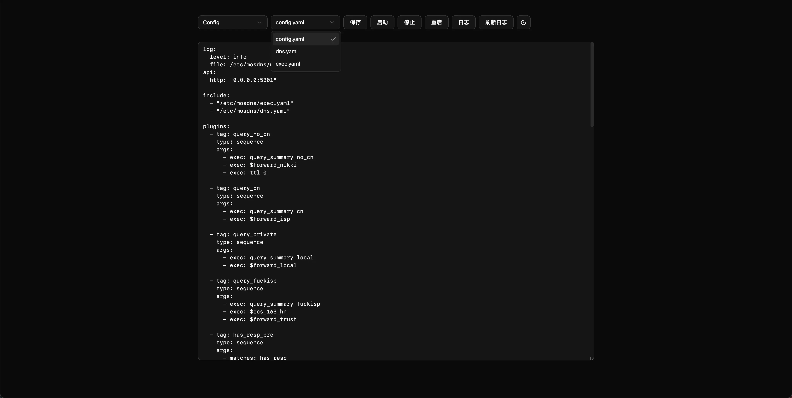
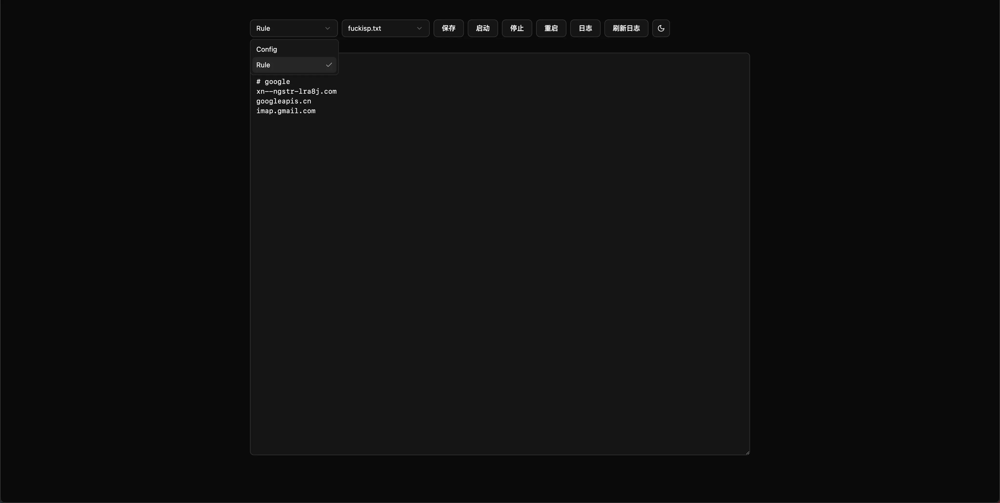
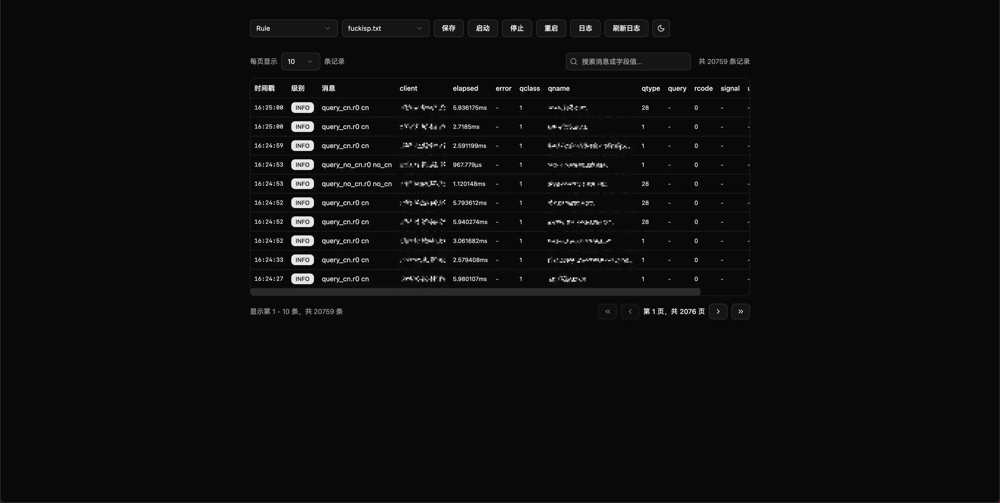

## 简单使用流程

1. clone 本项目
2. `cd mosdash && go mod tidy`
2. `cd webapp && pnpm install && pnpm run build`
2. `cd .. && mv webapp/dist ./app && make`

> [!IMPORTANT]  
> 为确保本项目正常使用，最好保持 mosdns 的配置目录与下列一样

```
mosdns/
├── config.yaml
├── dns.yaml
├── exec.yaml
├── mosdns.log
├── rule
│   ├── blocklist.txt
│   ├── ddnslist.txt
│   ├── ...
```

## 注意事项

1. 启动、停止等命令是通过 `systemctl [command] mosdns` 实现的
2. mosdns.log 没有做分割处理，全部发到了前端，如果太大了可能会出问题，我使用脚本每天清理一次日志
3. 如果你的规则文件结构与我不同，并且会自己修改代码（AI 也可以），可以修改 `routes/rules` 目录下的文件以及 `webapp/src/app.tsx` 来定制属于你的 mosdash
4. 本项目属于满足个人需求为主的小玩具，所以不太会持续更新以及增加新功能，如有需要请自行 fork

## 预览图





